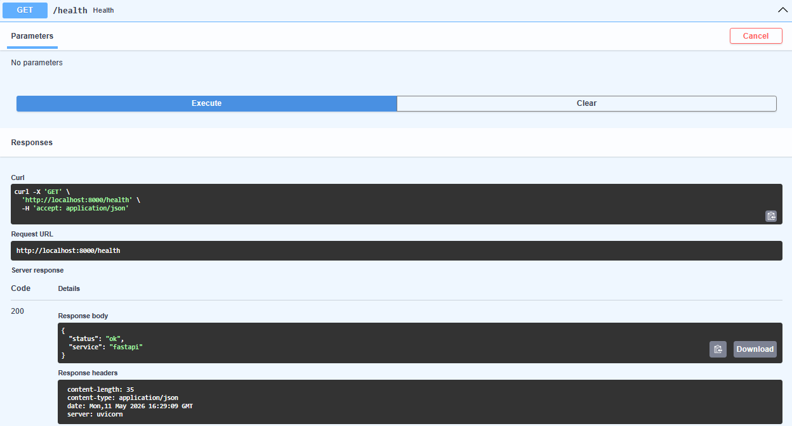
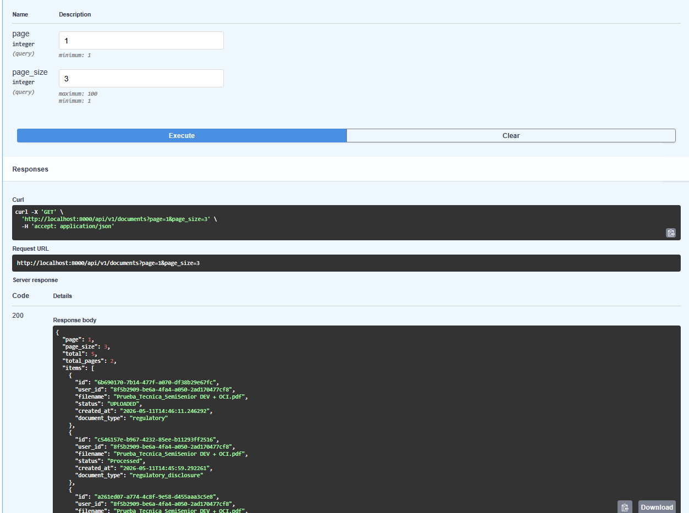
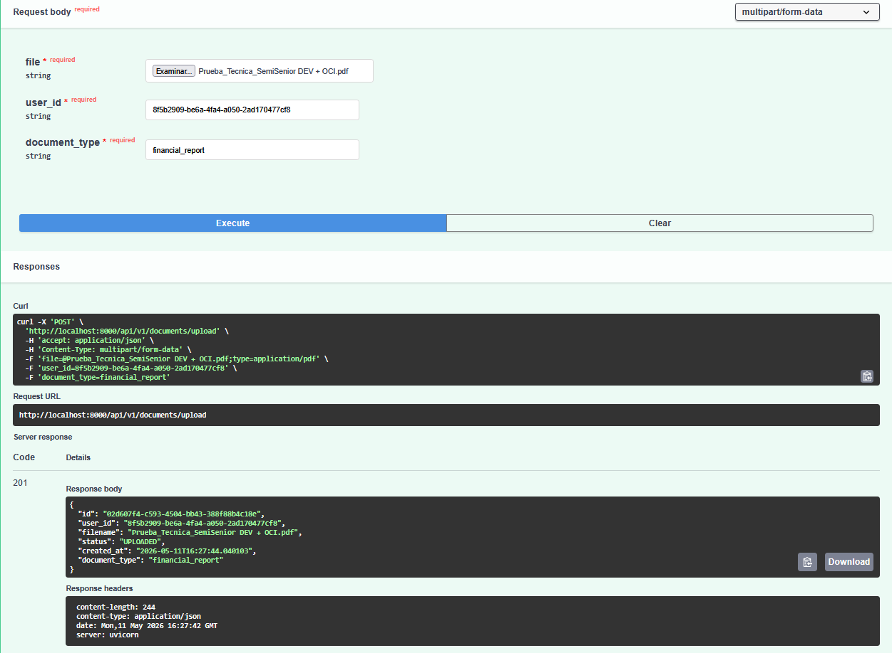

## Ingresar a FastAPI
### URL: http://localhost:8000/docs#/

Se debe hacer uso de los endpoints y formularios dentro de fastAPI.

## GET /health

## POST /api/v1/documents/{document_id}/process

# GET /api/v1/documents

# POST /api/v1/documents/upload
