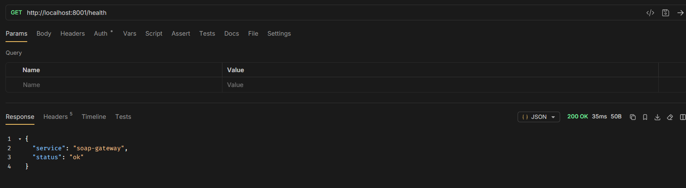
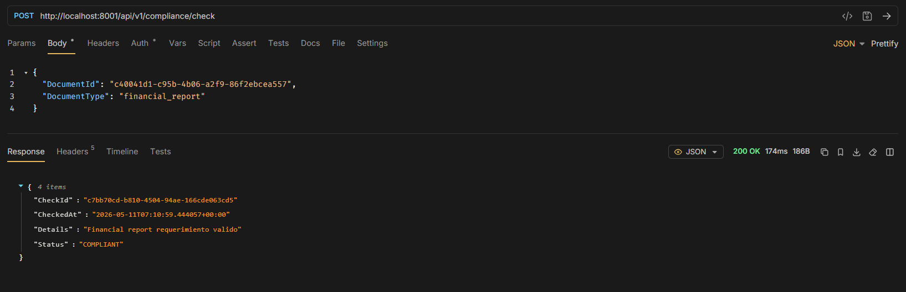
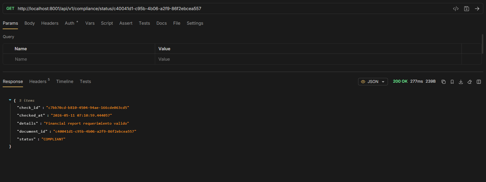

# Rutas

## GET /health
### URL: http://localhost:8001/health

### Response
```
{
  "service": "soap-gateway",
  "status": "ok"
}
```



## POST /Compilance_check
### URL: http://localhost:8001/api/v1/compliance/check

### Request

```
{
  "DocumentId": "c40041d1-c95b-4b06-a2f9-86f2ebcea557",
  "DocumentType": "(financial_report | tax_filing | regulatory_disclosure)"
}
```

### Response
```
{
    "CheckId":"c7bb70cd-b810-4504-94ae-166cde063cd5"
    "CheckedAt":"2026-05-11T07:10:59.444057+00:00"
    "Details":"Financial report requerimiento valido"
    "Status":"COMPLIANT"
}
```



## GET /compilance/status
### URL: http://localhost:8001/api/v1/compliance/status/< DocumentId >


### Response
```
{
"check_id":"c7bb70cd-b810-4504-94ae-166cde063cd5"
"checked_at":"2026-05-11 07:10:59.444057"
"details":"Financial report requerimiento valido"
"document_id":"c40041d1-c95b-4b06-a2f9-86f2ebcea557"
"status":"COMPLIANT"
}
```

