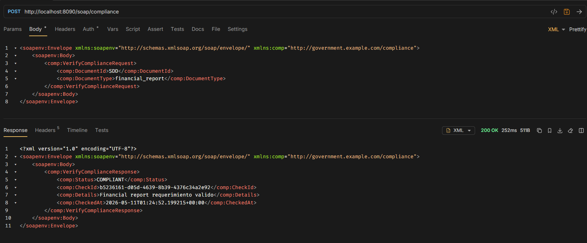
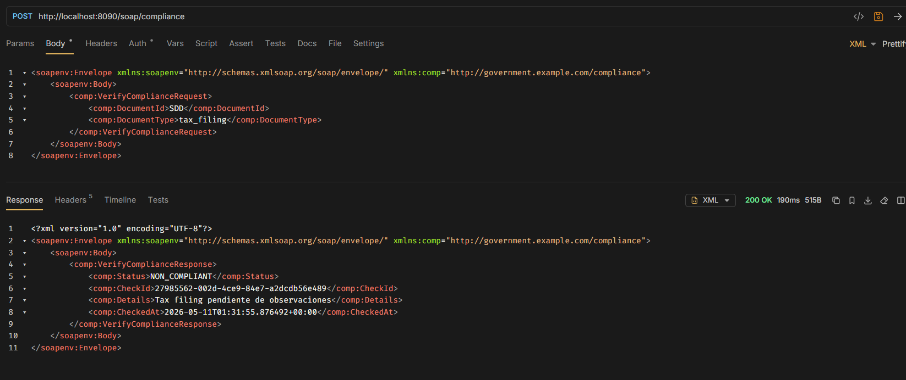
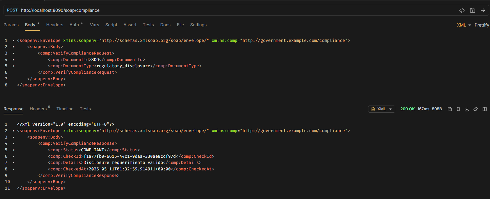
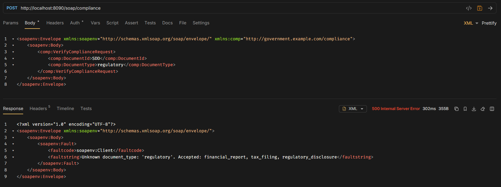

# Rutas

## GET /health
### URL: http://localhost:8090/health

### Response
```
{
  "service": "mock-soap",
  "status": "ok"
}
```

## POST /soap/Compilance 
### URL: http://localhost:8090/soap/compliance

### Request

```
<soapenv:Envelope xmlns:soapenv="http://schemas.xmlsoap.org/soap/envelope/" xmlns:comp="http://government.example.com/compliance"> 
    <soapenv:Body> 
        <comp:VerifyComplianceRequest> 
        <comp:DocumentId>string</comp:DocumentId> 
        <comp:DocumentType>string (financial_report | tax_filing | regulatory_disclosure)</comp:DocumentType>
        </comp:VerifyComplianceRequest> 
    </soapenv:Body> 
</soapenv:Envelope>
```

### Response
```
<comp:VerifyComplianceResponse> 
    <comp:Status>COMPLIANT | NON_COMPLIANT</comp:Status>
    <comp:CheckId>uuid</comp:CheckId> 
    <comp:Details>string</comp:Details> 
    <comp:CheckedAt>dateTime</comp:CheckedAt>
</comp:VerifyComplianceResponse>
```


### Comportamiento esperado
-----

| DocumentType          |      Resultado      | 
|-----------------------|:-------------------:|
| financial_report      | COMPLIANT           | 
| tax_filing            | NON_COMPLIANT       | 
| regulatory_disclosure | COMPLIANT           |
| Otro valor            | SOAP Fault          |

### Evidencia

* financial_report


* tax_filing 


* regulatory_disclosure


* Otro valor
